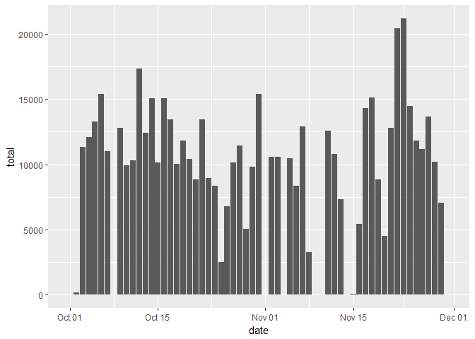
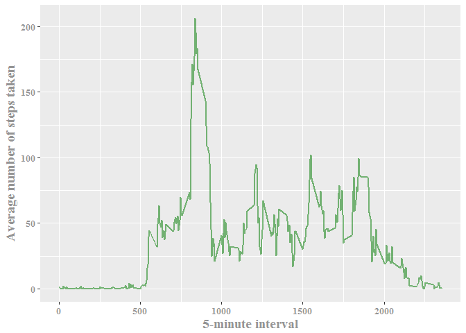
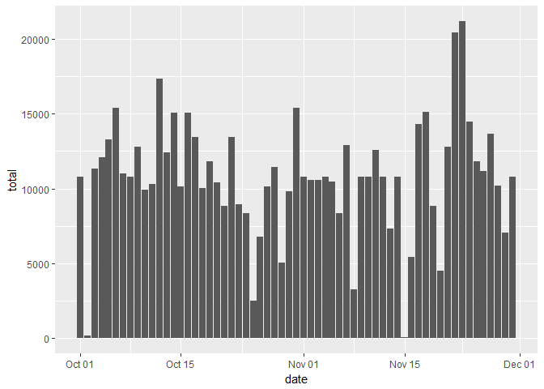
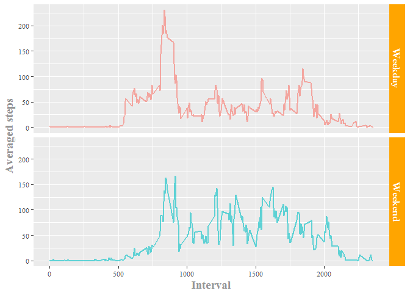

# Reproducible Research: Peer Assessment 1
Bing  
It is now possible to collect a large amount of data about personal movement using activity monitoring devices such as a Fitbit, Nike Fuelband, or Jawbone Up. These type of devices are part of the "quantified self" movement -- a group of enthusiasts who take measurements about themselves regularly to improve their health, to find patterns in their behavior, or because they are tech geeks. But these data remain under-utilized both because the raw data are hard to obtain and there is a lack of statistical methods and software for processing and interpreting the data.

This assignment makes use of data from a personal activity monitoring device. This device collects data at 5 minute intervals through out the day. The data consists of two months of data from an anonymous individual collected during the months of October and November, 2012 and include the number of steps taken in 5 minute intervals each day.

## Loading and preprocessing the data
Load the raw data by the following code:

```r
activity <- read.csv("activity.csv", colClasses = c("integer", "Date", "factor"))
```
The three colums of the raw dataset, Steps, Date and Interval are read as "integer", "Date" and "factor" respectively.

## What is mean total number of steps taken per day?
For this part of the assignment, the missing values of the dataset are ignored. 

1. Make a histogram of the total number of steps taken each day


```r
perday <- group_by(activity, date)
tgt <- summarise(perday, total = sum(steps, na.rm = T))
ggplot(data = tgt, aes(x = date)) +
      geom_bar(mapping = aes(y = total), stat = "identity")
```

<!-- -->

2. Calculate and report the mean and median total number of steps taken per day

```r
meansteps <- mean(tgt$total)
mediansteps <- median(tgt$total)
```

The mean of the steps taken daily is 9354.2295082, and the median is 10395.


## What is the average daily activity pattern?
1. Make a time series plot (i.e. type = "l") of the 5-minute interval (x-axis) and the average number of steps taken, averaged across all days (y-axis)

```r
perinterval <- group_by(activity, interval)
daily <- summarise(perinterval, mean = mean(steps, na.rm = T))
daily$interval <- as.numeric(as.character(daily$interval))
ggplot(data = daily[order(as.numeric(as.character(daily$interval))), ]) +
      geom_line(mapping = aes(x = interval, y = mean), 
                size = 0.8, 
                color = "forestgreen",
                alpha = 0.6) +
      labs(x = "5-minute interval",
           y = "Average number of steps taken") +
      theme(axis.title = element_text(face = "bold", 
                                      color = "grey58", 
                                      family = "serif", 
                                      size = 14),
            axis.text = element_text(face = "bold", 
                                      color = "grey58", 
                                      family = "serif", 
                                      size = 10))
```

<!-- -->


2. Which 5-minute interval, on average across all the days in the dataset, contains the maximum number of steps?


```r
maxinterval <- daily[daily$mean == max(daily$mean), ][[1]]
```

The interval that contains the maximum number of steps is 835.
## Imputing missing values
Note that there are a number of days/intervals where there are missing values (coded as NA). The presence of missing days may introduce bias into some calculations or summaries of the data.

1. Calculate and report the total number of missing values in the dataset (i.e. the total number of rows with NAs)

```r
nacount <- sum(is.na(activity$steps))
```
The total number of missing values is 2304.

2. Devise a strategy for filling in all of the missing values in the dataset. The strategy does not need to be sophisticated. For example, you could use the mean/median for that day, or the mean for that 5-minute interval, etc.

Here in this study, the missing values will be replace by the averaged value of the certain interval.

3. Create a new dataset that is equal to the original dataset but with the missing data filled in.

The missing values in Steps will be replaced by using ``apply`` function.


```r
nafilled <- activity
nafilled$steps <- apply(activity, 1, 
              function(x){
                    if(is.na(x[[1]])){
                          x[[1]] = daily[daily$interval == x[[3]],][[2]]
                    }
                    else{
                          x[[1]]
                    }
                    })
nafilled$steps <- as.numeric(nafilled$steps)
```


4. Make a histogram of the total number of steps taken each day and Calculate and report the mean and median total number of steps taken per day. Do these values differ from the estimates from the first part of the assignment? What is the impact of imputing missing data on the estimates of the total daily number of steps?

Make the plot using `ggplot`.

```r
perday_nafilled <- group_by(nafilled, date)
tgt_nafilled <- summarise(perday_nafilled, total = sum(steps, na.rm = T))
ggplot(data = tgt_nafilled, aes(x = date)) +
      geom_bar(mapping = aes(y = total), stat = "identity")
```

<!-- -->

And calculate the mean and median again with the new dataset without missing values.


```r
meansteps_nafilled <- mean(tgt_nafilled$total)
mediansteps_nafilled <- median(tgt_nafilled$total)
```

The new mean is 1.0766189\times 10^{4}, and the new median is 1.0766189\times 10^{4}. They are both larger than the previously calculated results.

## Are there differences in activity patterns between weekdays and weekends?
1. Create a new factor variable in the dataset with two levels -- "weekday" and "weekend" indicating whether a given date is a weekday or weekend day.

Here, `mutate` function is used to add a new variable.


```r
nafilled <- mutate(nafilled, 
                   day = as.factor(ifelse(weekdays(date) == "Saturday" | 
                                      weekdays(date) == "Sunday", 
                                "Weekend", "Weekday")))
```

2. Make a panel plot containing a time series plot (i.e. type = "l") of the 5-minute interval (x-axis) and the average number of steps taken, averaged across all weekday days or weekend days (y-axis).


```r
perinterval_nafilled <- group_by(nafilled, interval, day)
daily_nafilled <- summarise(perinterval_nafilled, mean = mean(steps, na.rm = T))
daily_nafilled$interval <- as.numeric(as.character(daily_nafilled$interval))
ggplot(data = daily_nafilled) +
      geom_line(mapping = aes(x = interval, y = mean, color = day), size = 1, alpha = 0.6) +
      facet_grid(day ~.) +
      labs(x = "Interval",y = "Averaged steps") +
      theme(axis.title = element_text(hjust = 0.5, face="bold", size=14, 
                                      color = "grey58", family = "serif"),
            axis.text = element_text(hjust = 0.5, size=8, 
                                     color = "grey28", family = "serif"),
            strip.background = element_rect(fill = "orange"),
            strip.text = element_text(face="bold", 
                                      size=12, 
                                      color = "white", 
                                      family = "serif"),
            legend.position = "none")
```

<!-- -->
